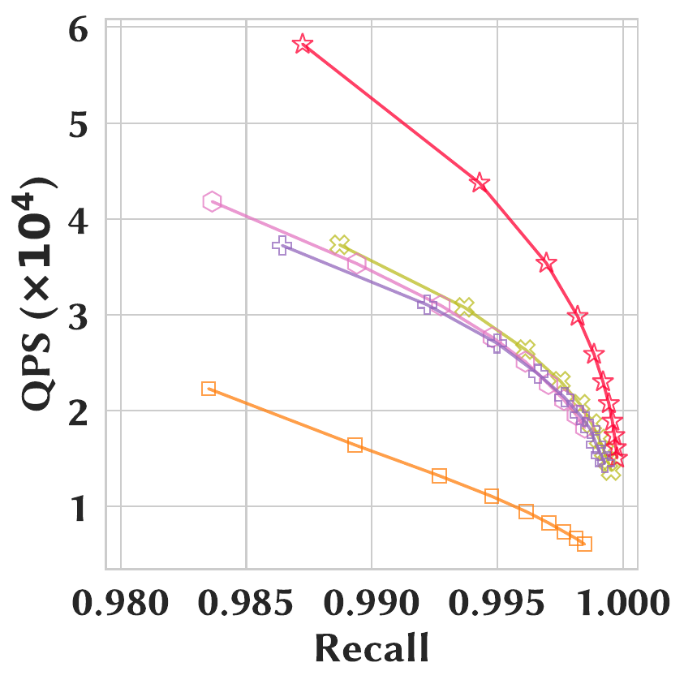
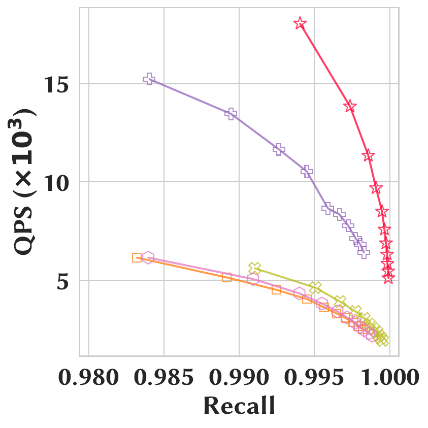
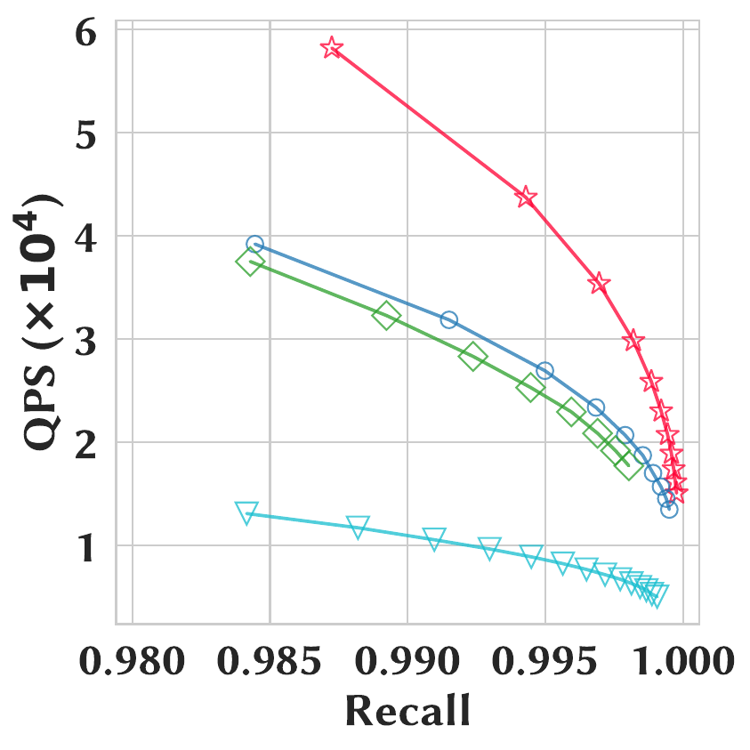
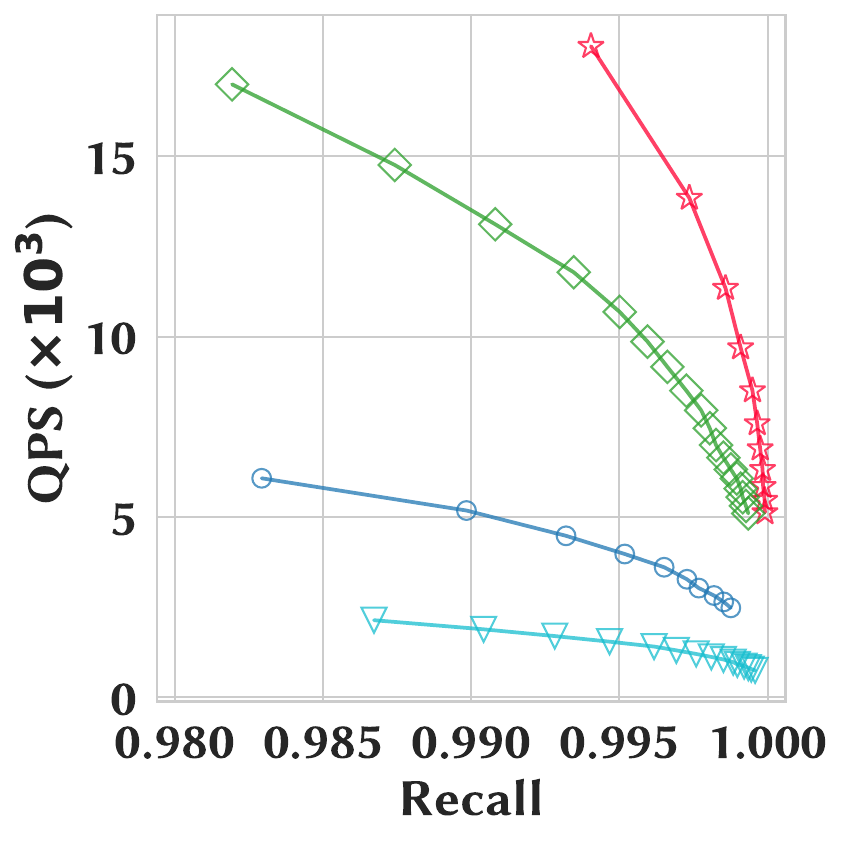
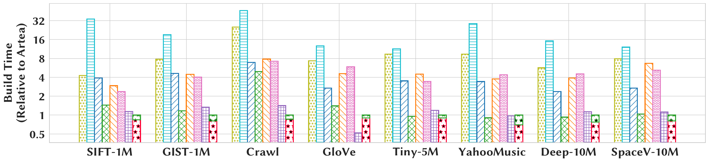

<div align="center">


### Theory-Guided Hierarchical Graph Index for High-Performance ANN Search

[](https://isocpp.org/)
[](https://cmake.org/)
[](https://www.intel.com/content/www/us/en/developer/tools/oneapi/overview.html)
[](#)
[](https://www.apache.org/licenses/LICENSE-2.0)

</div>

<div align="center">

📄 &nbsp; $\color{red}{\Large \textsf{Full technical report with complete proofs and derivations:}}$

### ➡️ [Click this link: `artea/artea-technical-report.pdf`](artea-technical-report.pdf)

</div>

ARTEA is a hierarchical proximity-graph index for approximate nearest neighbor
(ANN) search. It pairs a **deterministic bottom-up *r*-net hierarchy** with
**Aspect-Ratio-Constrained Pruning (ARC-Pruning)**, bounding the worst-case
search complexity to <code>O((α·τ)<sup>λ</sup> + α<sup>λ</sup> log Δ)</code> — the
first proximity graph with a *strictly logarithmic* dependence on the dataset
aspect ratio Δ — while delivering state-of-the-art query throughput and
competitive build time.

---

## Build & Compile

Use a C++20 compiler with OpenMP support, CMake 3.24+, and Boost development
packages. The default setup supports Linux x86-64 with glibc 2.28+.
CMake handles oneTBB and MKL automatically; the first build requires internet access.

Run from the repository root:

```sh
# Configure + build
bash ./scripts/install.sh

# Smoke-test the build
./build/unit_tests/test_artea_graph --help
```

## Quick Start

Set the SIFT-1M dataset paths in [`configs/datasets.json`](configs/datasets.json).
The following example loads the data, builds and compacts an index, then searches it:

```cpp
#include <artea/cpu/framework/artea.hpp>
#include <artea/cpu/framework/type_context/default_context.hpp>
#include <artea/cpu/framework/type_context/infra_dispatcher.hpp>
using namespace artea;
using namespace artea::cpu;

// 1. Load the dataset.
vector_dataset_t dataset("configs/datasets.json", "sift-1m");
const auto& base_vecs = dataset.get_base_vecs();
const DatasetInfra info{parse_metric("euclidean"), base_vecs.get_vec_dim()};

// 2. Build and compact the index using Euclidean distance.
auto compact_hg = build_infra_dispatch(info, ARTEA_METRIC_LAMBDA(compact::hierarchical_graph_t) {
    dist_func_t<Metric, Dim> build_dist;
    artea_graph::rgraph_config_t<Metric, Dim> rgraph_cfg(
        /*rnet_beta=*/2.0, /*num_skip_levels=*/0u,
        /*l0_min_distance=*/1.0, /*search_nn_qs=*/64);
    artea_graph::propagate_config_t<Metric, Dim> propagate_cfg(
        /*build_loops=*/15, /*triu_iters=*/4, /*prefill=*/0.4f);
    artea_graph::pruning_config_t<Metric, Dim> pruning_cfg(/*scale=*/1.10, /*shift=*/1.5);

    auto graph = std::make_unique<artea_graph::index_t<Metric, Dim>>(
        base_vecs.get_num_vecs(), rgraph_cfg, propagate_cfg, pruning_cfg);
    artea_graph::factory_t<Metric, Dim>::add_vertices(
        *graph, base_vecs.extract_subset(0, base_vecs.get_num_vecs()), build_dist,
        /*insert_on_L0=*/false, /*shuffle=*/true);
    return hierarchical_graph_compactor_t::compact_graph(
        graph->get_hierarchical_graph(), base_vecs, build_dist);
});

// 3. Search using squared Euclidean distance.
search_infra_dispatch(info, ARTEA_METRIC_LAMBDA(void) {
    dist_func_t<Metric, Dim> search_dist;
    hierarchical_graph_router_t<Metric, Dim> router(
        base_vecs, search_dist, /*topk=*/100, /*queue=*/200);
    router.initialize();
    auto results = router.template batch_query</*RandomSeeding=*/false, /*UpperBeam=*/false>(
        dataset.get_query_vecs(), compact_hg);
});
```

For a runnable example with dataset-specific settings, see
[`unit_tests/test_artea_graph.cpp`](unit_tests/test_artea_graph.cpp) and the
[`workloads/`](workloads/README.md) guide. Metric and radius conventions are
documented in the [test guide](unit_tests/README.md#about-metrics).

## Performance

**Recall@100 vs. throughput** — ARTEA traces the best QPS–recall Pareto frontier
against both flat and hierarchical baselines.

|            | SIFT-1M | YahooMusic |
|:----------:|:-------:|:----------:|
| **vs. flat** (NSG / Vamana / τ-MNG / α-CNG)  |  |  |
| **vs. hierarchical** (HNSW / HCNNG / MIRAGE) |  |  |

**Index construction time** (relative to ARTEA, lower is better) across all datasets:

<div align="center">

</div>

## Citation

If you use ARTEA, please cite the repository:

```bibtex
@software{artea_repo,
  title     = {{ARTEA}: Theory-Guided Hierarchical Graph Index for High-Performance ANN Search},
  author    = {Ye, Weitang and Mo, Dingheng and Luo, Siqiang},
  year      = {2026},
  publisher = {GitHub},
  url       = {https://github.com/NTU-Siqiang-Group/Artea}
}
```
