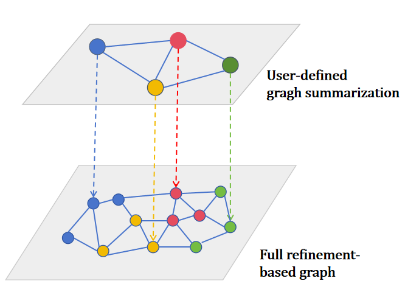
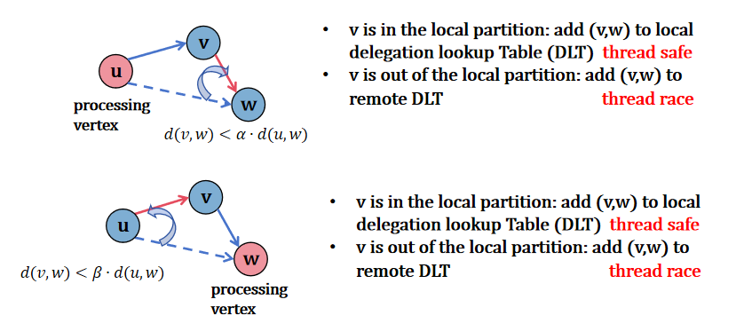

# Artea: High performance graph based approximate nearest neighbors index construction and search library.

## Installation and Tests

1. Step 1: Initialize intel oneapi environment variables:

```sh
# source /path/to/your/oneapi/setvars.sh
source $HOME/intel/oneapi/setvars.sh
```

2. Step 2: Build and run tests:

```sh
rm -rf build    # Optional: clean previous builds
# Assuming you are using intel oneapi compiler
cmake -B build -DCMAKE_BUILD_TYPE=Release \
      -D CMAKE_CXX_COMPILER=$HOME/intel/oneapi/compiler/latest/bin/icpx \
      -D CMAKE_C_COMPILER=$HOME/intel/oneapi/compiler/latest/bin/icx

# debug mode
cmake -B build -DCMAKE_BUILD_TYPE=Debug \
      -D CMAKE_CXX_COMPILER=$HOME/intel/oneapi/compiler/latest/bin/icpx \
      -D CMAKE_C_COMPILER=$HOME/intel/oneapi/compiler/latest/bin/icx

# If you do not have intel oneapi compiler, you can use gcc/g++ alternatively
cmake -B build -DCMAKE_BUILD_TYPE=Release \
      -D CMAKE_CXX_COMPILER=/usr/local/gcc-14/bin/g++ \
      -D CMAKE_C_COMPILER=/usr/local/gcc-14/bin/gcc

cmake --build build -j64
./build/tests/test_simd_distance    # e.g. test the SIMD distance implementation
```

> [!NOTE]
>
> To get the total lines of code in the include directory, you can run the following command:
>
> ```shell
> find ./include -type f \( -name "*.hpp" -o -name "*.cpp" \) | xargs wc -l
> ```

## Designations

### Summarization Module: <u>B</u>alanced and <u>I</u>ncremental Clustering using <u>N</u>avigable <u>G</u>raph (BING)

#### Objective Function

This module aims to maximize the following objective function:

$$
\mathbb{C} = \left\{ C_1, C_2, \cdots, C_k \right\}\\
O_{Partition} = A\cdot\sum_{C_i \in \mathbb{C}} \sum_{u\in C_i}\sum_{v\in C_i/\{u\}} \mathbb{I}\left\{v\in \mathbb{N}_r(u)\right\} - B\cdot \sum_{C_i \in \mathbb{C}} \left| |C_i| - \frac{n}{k} \right|
$$

By maximizing the first term, we hope that data points within the same cluster are closely connected in the r-NN graph, promoting intra-cluster similarity. The second term penalizes deviations from the ideal cluster size of n/k, thereby encouraging balanced cluster sizes across the dataset. The constants A and B are used to weight the importance of these two objectives.

We hierarchically sample the data points to create a multi-level representation of the dataset. At each level, we perform clustering using the r-NN graph constructed from the sampled points. This hierarchical structure will be served as A BETTER CHOICE of HNSW-like routing layers.



#### Baseline: Hierarchical Sampled Kmeans|| Clustering

####Clustering Feature


### Propagation Module: Bidirectional RNG Propagation



Following experiment data was generated with current library implementation: Kmeans|| Graph Summarization + Bidirectional RNG Propagation.

We fine-tuned the parameters for all methods to ensure 99% recall@10 on the SIFT1M dataset.

| Dataset/Setting/Result       | Baseline (RNN-Descent)  | BRNG (Artea)                         | GS+BRNG (Artea)                      |
| ---------------------------- | ----------------------- | ---------------------------- | ---------------------------- |
| Parameter Setting            | S=20, R=96, T1=4, T2=15 | S=16, R=$\infty$, T=30, K=64 | S=16, R=$\infty$, T=30, K=64 |
| Construction Performance (s) | 36.296                  | 30.131                       | 16.382                       |
| Search Performance (QPS)     | 21273.91                | 30847.16                     | 47382.83                     |

We fine-tuned the parameters for all methods to ensure 99% recall@10 on the GIST1M dataset.

| Dataset/Setting/Result       | Baseline (RNN-Descent)        | BRNG                         | GS+BRNG                      |
| ---------------------------- | ----------------------------- | ---------------------------- | ---------------------------- |
| Parameter Setting            | S=20, R=96, T1=4, T2=15, K=64 | S=16, R=$\infty$, T=30, K=64 | S=16, R=$\infty$, T=30, K=64 |
| Construction Performance (s) | 159.95                        | 126.10                       | 68.39                        |
| Search Performance (QPS)     | 2799.11                       | 4812.40                      | 6119.35                      |

### Maintenance Module: Batched RNG Descent


